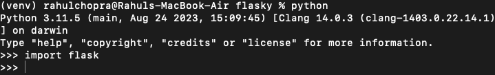
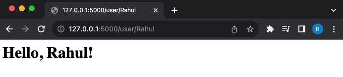
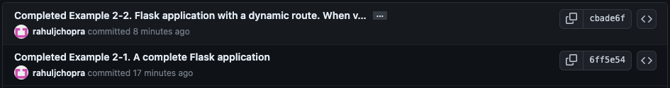
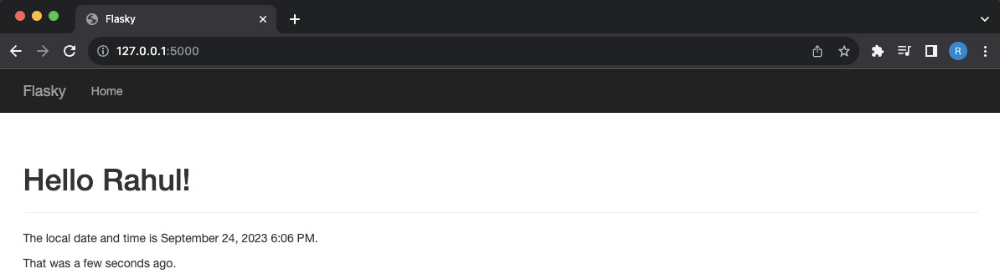
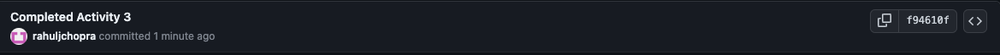
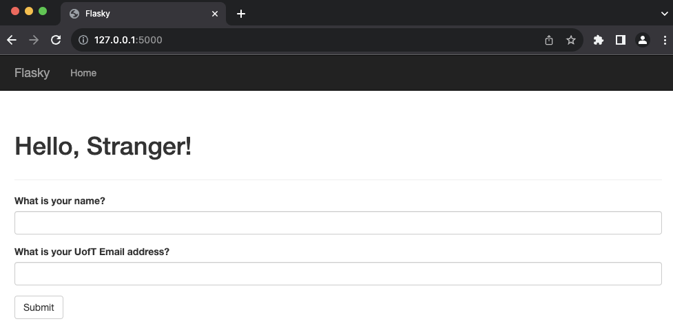
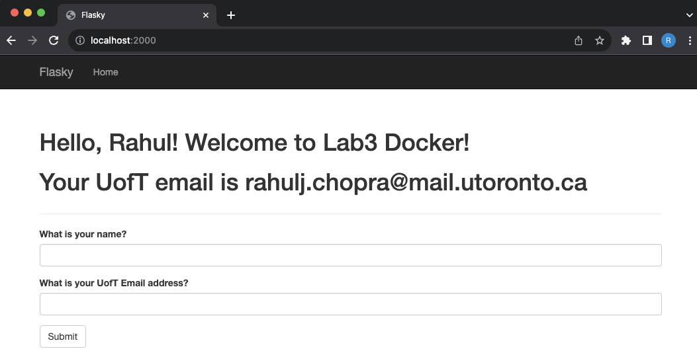
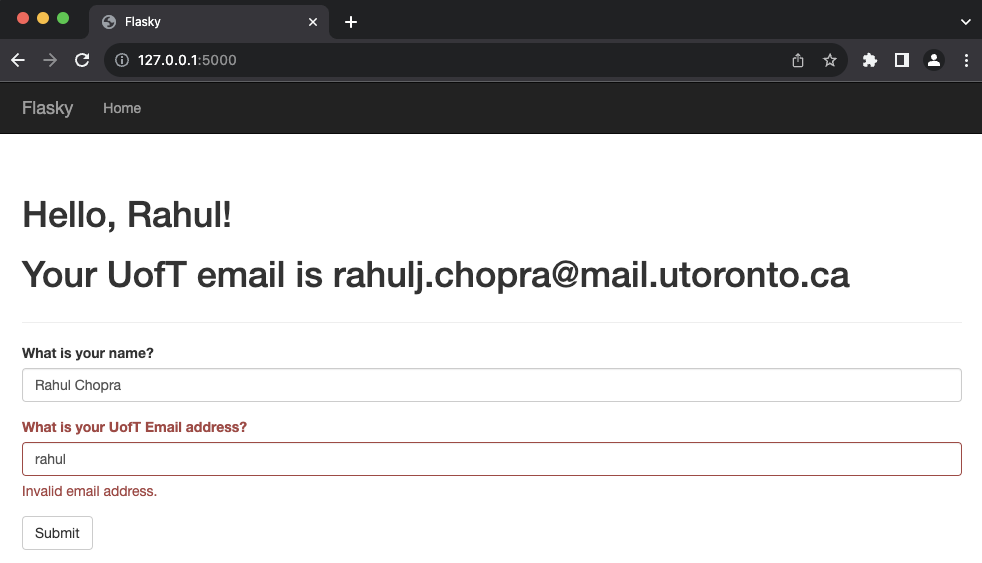
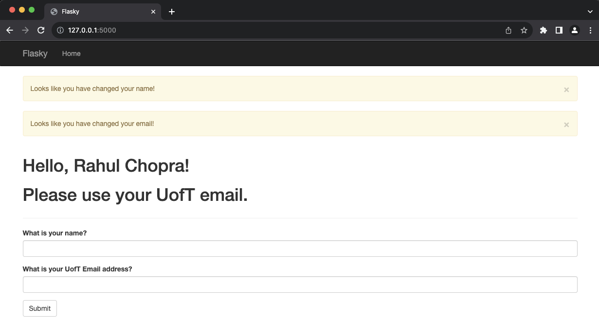

# ECE444-F2023-Lab1

Done by: Rahul Chopra

This repo is a clone of https://github.com/miguelgrinberg/flasky

***

Activity 1: A screenshot of the virtual environment created and flask imported

***

Activity 2: A screenshot of the Flask application with a dynamic route

***

Activity 3: A screenshot of the Flask application with the 3 elements

***

Activity 4: Screenshots of the Flask application with the name and email inputs

